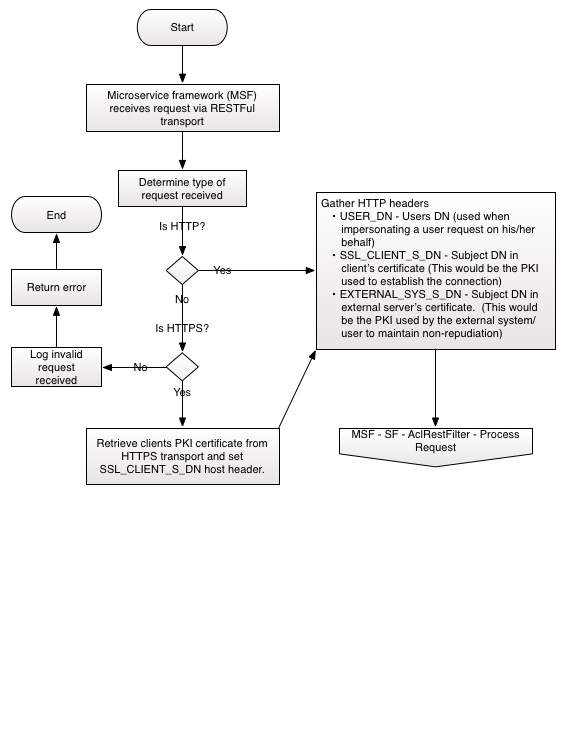
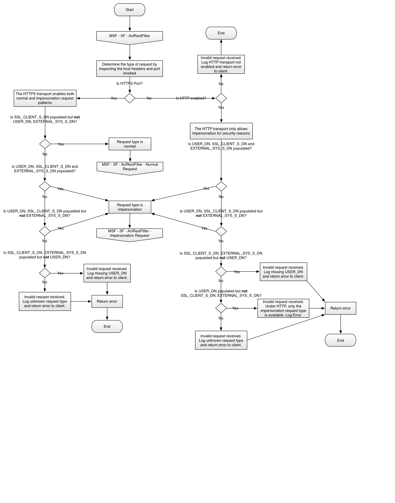
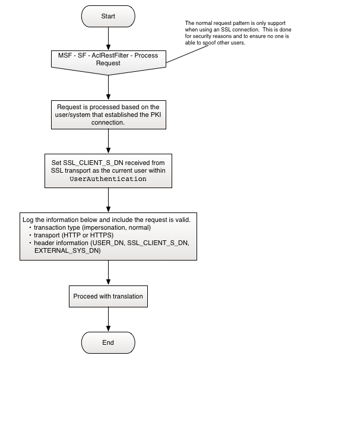
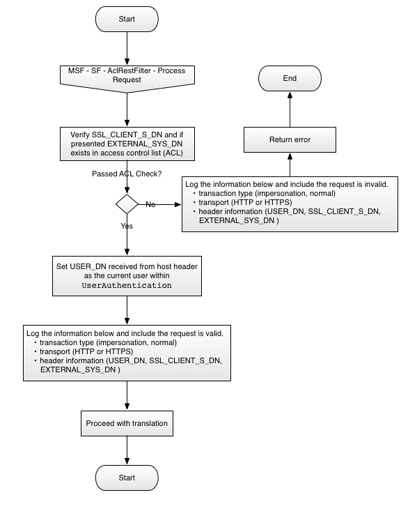

# Overview
This document discusses how to set up the AclRestFilter and configure it to protect HTTP and HTTPS endpoints in the your microservice.

# Prerequisites

- To support HTTPS
    - [Configure 2-Way SSL](TwoWaySSL.md)
    - [Assert others](WhitelistClientFilter.md)
- To support HTTP
    - [Assert others](WhitelistClientFilter.md)

# Process Flows
The following diagrams define the business logic of this filter.

### AclRestFilter

### AclRestFilter - Process Request

### AclRestFilter - Normal Request

### AclRestFilter - Impersonation Request

# Step-by-step guide

There are up to three headers that must be provided depending on the protocol being accessed, HTTP or HTTPS. They are __user_dn__, __ssl_client_s_dn__, and or __external_sys_dn__. The __ssl_client_s_dn__ and __external_sys_dn__ headers are always looked up in the acl-whitelist file. When either of these two headers are looked up and the values are not found in the acl-whitelist file, the connection will be automatically terminated. At minimum if a server is asserting on the behalf of a user, __ssl_client_s_dn__ is always required. The __external_sys_dn__ must always be accompanied by __ssl_client_s_dn__ header otherwise as the connection will be terminated.

# HTTPS

## Scenario 1

The user is making a direct connection to the service. In this case, their DN is retrieved from __ssl_client_s_dn__ automatically. This happens at the SSL Context level and there is nothing to configure for this. The users DN is then allowed to continue on if valid. In this scenario, no headers have to be provided. Everything is figured out.

## Scenario 2

The user is making a connection to the service through another service. In this case, the user DN must be assigned to __user_dn__. The filter will retrieve the server that is asserting said user, from __ssl_client_s_dn__; again filled in by the SSL Context. The asserting server's DN must be in the acl-whitelist file otherwise the connection will be rejected. The __user_dn__ header must be configured.

## Scenario 3

The user is making a connection to the external facing service through another server. In essence this is a two hop assertion. The external server's DN must be assigned to __external_sys_dn__ and the user's DN must be assigned to __user_dn__. The __ssl_client_s_dn__ header will be filled in by the SSL Context. In this scenario, then both __ssl_client_s_dn__ and __external_sys_dn__ are required to exist in the acl-whitelist file. Any other configuration of the headers and the connection is rejected.

## Scenario 4

Any other combination of provided and or lack there of headers will cause the filter to automatically reject the connection.

# HTTP

Since there is no SSL then the SSL Context to provide the __ssl_client_s_dn__ automatically, does not exist. Therefor the __ssl_client_s_dn__ header must defined all the time and the DN assigned must exist in the acl-whitelist file.

## Scenario 1

The user is connecting to the external facing service through another server. In this case all three headers are required, __user_dn__, __ssl_client_s_dn__, and __external_sys_dn__. The user's DN is assigned to __user_dn__. The external server that the user is making the request from is assigned to __external_sys_dn__ and the server making the hop request, it's DN must be assigned to __ssl_client_s_dn__. If either __ssl_client_s_dn__ and or __external_sys_dn__ are not in acl-whitelist file, the connection will be terminated.

## Scenario 2

The user is connecting to the external facing service. The __user_dn__ and __ssl_client_s_dn__ headers must be provided. If the DN assigned to __ssl_client_s_dn__ does not exist in acl-whitelist file then the connection is terminated.

## Scenario 3

Any other combination of headers provided and or lack of means automatic rejection of the connection.

# Activating the AclRestFilter
The following code shows how to enforce protection on the RESTful endpoint.
    
    package com.somepackage
    
    import java.io.File
    
    import com.somepackage.rest.MyFirstMicroserviceRestController
    import com.somepackage.thrift.MyFirstMicroserviceThriftService
    import com.deciphernow.server.security._
    import com.deciphernow.server.{GMFabricServer, RestServer, ThriftServer}
    import com.deciphernow.server.Implicits._
    
    import scala.concurrent.duration.Duration
    
    object MyFirstMicroservice extends GMFabricServer {
    
          val myFirstMicroserviceManager = new MyFirstMicroserviceManager
        
          // When using impersonating security filters, we need an access manager
          var accessManager: FileWhitelistImpersonationAccessManager = _
          // The access manager will require a whitelist file.  This is one way to use configuration for the file path
          val whitelistFile = flag[File]("acl.whitelist.file", "ACL whitelist file for user impersonation")
        
          premain {
            // If we want to create the access manager, do it in the premain block like this.
            // Note we need to do it outside the class body (in premain) because flag parsing occurrs later
            accessManager = new FileWhitelistImpersonationAccessManager(
               whitelistFile(), Duration(1, "minute")
            )
          }
        
          /*
            Assign None to server if no server is going to be defined.
            def thrift = None
           */
          def thrift = Some(new ThriftServer(
            Seq(new WhitelistClientFilter(accessManager)),
            new MyFirstMicroserviceThriftService(myFirstMicroserviceManager)
          ))
        
          /*
            A rest server is always required since the admin server is
            instantiated here.
         */
          def rest = Some(new RestServer(
            Seq(new AclRestFilter(accessManager)),
            Seq(new MyFirstMicroserviceRestController(myFirstMicroserviceManager))
          ))
    }   
    
# Unauthorized return messages

Unless explicitly specified, the status code for each response defined here is 401.

- Request comes in on HTTPS with the following configured headers: __user_dn__, and __external_sys_dn__. if either ssl_client_s_dn or extern al_sys_dn are not in the acl-whitelist.
    - RESPONSE : Unauthorized: Either or both of the __ssl_client_s_dn__ or __external_sys_dn__ are not authorized to impersonate or have access.
    
- Request comes in on HTTPS with __user_dn__. if ssl_client_s_dn not in the acl-whitelist.
    - RESPONSE : Unauthorized: The __ssl_client_s_dn__ is not authorized to impersonate or have access.
    
- Request comes in on HTTPS with no __user_dn__ and __external_sys_dn__ is configured. 
    - RESPONSE : Unauthorized: Missing the __user_dn__.
    
- Any other configuration of the headers during HTTPS request.
    - RESPONSE : Unauthorized: Invalid connection. Required headers, __user_dn__ and possibly __external_sys_dn__ are missing.
    
- Request comes in on HTTP and all headers are configured. If either ssl_client_s_dn or __external_sys_dn__ are not in the acl-whitelist. 
    - RESPONSE : Unauthorized: Either or both of the __ssl_client_s_dn__ or __external_sys_dn__ are not authorized to impersonate or have access.
    
- Request comes in on HTTP and __user_dn__ and ssl_client_s_dn are configured. If ssl_client_s_dn is not in the acl-whitelist 
    - RESPONSE : Unauthorized: The __ssl_client_s_dn__ is not authorized to impersonate or have access.
    
- Request comes in on HTTP and only have __user_dn__.
    - RESPONSE : Unauthorized: Connection is not authorized to impersonate. Neither __ssl_client_s_dn__ or __external_sys_dn__ where found.
    
- Request comes in on HTTP and catch all for bad header configuration.
    - RESPONSE : Unauthorized: Invalid connection. Required headers are missing, __user_dn__, __ssl_client_s_dn__, and or __external_sys_dn__.   
 
# Example Log Output
 
Please note the logs are spaced so its easier to read. They will not be spaced in a real log file.
    
    Transaction: IMPERSONATION VALID! UserAuthentication.current: CN=Bob Ward  transport: HTTP user_dn: [CN=Bob Ward] ssl_client_s_dn: [cn=assertion-server] external_sys_dn: [cn=external-sys-badger-assertion-server]

    Transaction: IMPERSONATION VALID! UserAuthentication.current: CN=Bob Ward  transport: HTTP user_dn: [CN=Bob Ward] ssl_client_s_dn: [cn=assertion-server] external_sys_dn: [not-provided]

    Transaction: IMPERSONATION INVALID! transport: HTTP user_dn: [not-provided] ssl_client_s_dn: [cn=assertion-server] external_sys_dn: [cn=external-sys-badger-assertion-server] Unauthorized: Invalid connection. Required headers are missing, user_dn, ssl_client_s_dn, and or external_sys_dn.  

    Transaction: IMPERSONATION INVALID! transport: HTTP user_dn: [CN=Bob Ward] ssl_client_s_dn: [not-provided]  external_sys_dn: [cn=external-sys-badger-assertion-server] Unauthorized: Connection is not authorized to impersonate. Neither ssl_client_s_dn or external_sys_dn where found.

    Transaction: IMPERSONATION INVALID! transport: HTTP user_dn: [CN=Bob Ward] ssl_client_s_dn: [bad-cn=assertion-server] external_sys_dn: [not-provided] Unauthorized: The ssl_client_s_dn is not authorized to impersonate or have access.

    Transaction: NORMAL VALID! UserAuthentication.current: CN=Bob Twiggy, O=ACME Inc, C=US  transport: HTTPS user_dn: [not-provided]  ssl_client_s_dn: [CN=Bob Twiggy, O=ACME Inc, C=US] external_sys_dn: [not-provided]

    Transaction: IMPERSONATION VALID! UserAuthentication.current: CN=Bob Ward  transport: HTTPS user_dn: [CN=Bob Ward] ssl_client_s_dn: [cn=assertion-server] external_sys_dn: [cn=external-sys-badger-assertion-server] Transaction: IMPERSONATION INVALID! transport: HTTPS user_dn: [CN=Bob Ward] ssl_client_s_dn: [cn=assertion-server] external_sys_dn: [bad-cn=external-sys-badger-assertion-server] Unauthorized: Either or both of the ssl_client_s_dn or external_sys_dn are not authorized to impersonate or have access.

    Transaction: IMPERSONATION VALID! UserAuthentication.current: CN=Bob Ward  transport: HTTPS user_dn: [CN=Bob Ward] ssl_client_s_dn: [cn=assertion-server] external_sys_dn: [not-provided]

    Transaction: IMPERSONATION INVALID! transport: HTTPS user_dn: [CN=Bob Ward] ssl_client_s_dn: [foo] external_sys_dn: [not-provided] Unauthorized: The ssl_client_s_dn is not authorized to impersonate or have access.

    Transaction: IMPERSONATION INVALID! transport: HTTPS user_dn: [not-provided] ssl_client_s_dn: [cn=assertion-server] external_sys_dn: [cn=assertion-server] Unathorized: Missing the user_dn.

# Clients
See 
    
    
