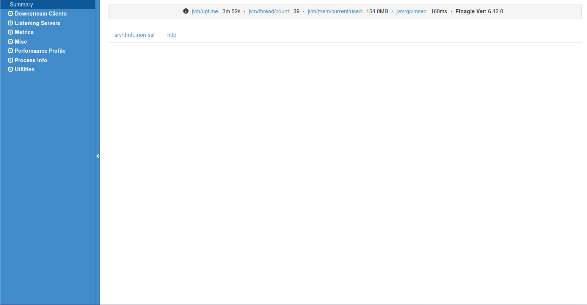

# Overview
This document does a cursory overview of where to go to identify running services and metrics.

## Logging into admin
To log into the admin page type the following URL in your browser.  This assumes that the admin port is the default port. On the summary page you will see the services that are available. In this example we only have HTTP and non-SSL Thrift.
.

## Listening servers
To see all servers including the admin server which is serving up these pages, select `Select Listening Servers`.
.

### See the metrics of all services 
Select on the left under `Metrics` select /admin/metrics.json

### Metrics.json 

To see the metrics of a particular RESTful service look for the following format `route/{service-name}/HTTP-METHOD`. As an example to find ping service metrics you look for `route/ping/GET` which would look like below:

        "route/ping/GET/requests" : 1,
        "route/ping/GET/response_size.avg" : 0.0,
        "route/ping/GET/response_size.count" : 0,
        "route/ping/GET/response_size.max" : 0,
        "route/ping/GET/response_size.min" : 0,
        "route/ping/GET/response_size.p50" : 0,
        "route/ping/GET/response_size.p90" : 0,
        "route/ping/GET/response_size.p95" : 0,
        "route/ping/GET/response_size.p99" : 0,
        "route/ping/GET/response_size.p9990" : 0,
        "route/ping/GET/response_size.p9999" : 0,
        "route/ping/GET/response_size.sum" : 0,
        "route/ping/GET/status/200" : 1,
        "route/ping/GET/status/2XX" : 1,
        "route/ping/GET/time.avg" : 0.0,
        "route/ping/GET/time.count" : 0,
        "route/ping/GET/time.max" : 0,
        "route/ping/GET/time.min" : 0,
        "route/ping/GET/time.p50" : 0,
        "route/ping/GET/time.p90" : 0,
        "route/ping/GET/time.p95" : 0,
        "route/ping/GET/time.p99" : 0,
        "route/ping/GET/time.p9990" : 0,
        "route/ping/GET/time.p9999" : 0,
        "route/ping/GET/time.sum" : 0,
        "route/ping/GET/time/200.avg" : 0.0,
        "route/ping/GET/time/200.count" : 0,
        "route/ping/GET/time/200.max" : 0,
        "route/ping/GET/time/200.min" : 0,
        "route/ping/GET/time/200.p50" : 0,
        "route/ping/GET/time/200.p90" : 0,
        "route/ping/GET/time/200.p95" : 0,
        "route/ping/GET/time/200.p99" : 0,
        "route/ping/GET/time/200.p9990" : 0,
        "route/ping/GET/time/200.p9999" : 0,
        "route/ping/GET/time/200.sum" : 0,
        "route/ping/GET/time/2XX.avg" : 0.0,
        "route/ping/GET/time/2XX.count" : 0,
        "route/ping/GET/time/2XX.max" : 0,
        "route/ping/GET/time/2XX.min" : 0,
        "route/ping/GET/time/2XX.p50" : 0,
        "route/ping/GET/time/2XX.p90" : 0,
        "route/ping/GET/time/2XX.p95" : 0,
        "route/ping/GET/time/2XX.p99" : 0,
        "route/ping/GET/time/2XX.p9990" : 0,
        "route/ping/GET/time/2XX.p9999" : 0,
        "route/ping/GET/time/2XX.sum" : 0,

To see the metrics for Thrift service look for `srv/thrift::non-ssl/{end-point}`. Below is an example of what the metrics look like for ping. If the Thrift service is SSL enabled then `srv/thrift::ssl/{end-point}`.

        "srv/thrift::non-ssl/method/ping.avg" : 0.0,
        "srv/thrift::non-ssl/method/ping.count" : 0,
        "srv/thrift::non-ssl/method/ping.max" : 0,
        "srv/thrift::non-ssl/method/ping.min" : 0,
        "srv/thrift::non-ssl/method/ping.p50" : 0,
        "srv/thrift::non-ssl/method/ping.p90" : 0,
        "srv/thrift::non-ssl/method/ping.p95" : 0,
        "srv/thrift::non-ssl/method/ping.p99" : 0,
        "srv/thrift::non-ssl/method/ping.p9990" : 0,
        "srv/thrift::non-ssl/method/ping.p9999" : 0,
        "srv/thrift::non-ssl/method/ping.sum" : 0,

