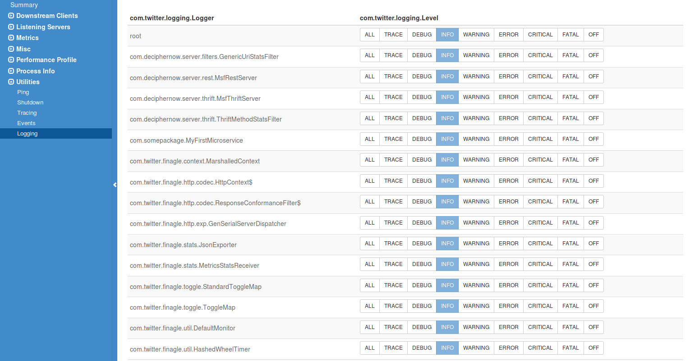

# Overview
This document defines how to leverage dynamic logging vs static logging.

## Logging
There are two types of logging configuration depending on the language the service is being developed in. If developing in Scala, then dynamic logging can be configured. What this means is that those scala classes can be hooked into a admin logging page that allows one to change the level of logging on the fly. This only works in Scala. Static logging using Logback is required if coding in Java.

### Scala classes

The scala classes in the microservice framework are registered through dynamic logging. This methodology can be extended into ones microservice. To change the level of logging you change it's log level through the admin panel.

- Add the dependency to your __pom.xml__

        <dependency>
            <groupId>com.twitter</groupId>
            <artifactId>util-logging_${version.scala.major}</artifactId>
            <version>${version.twitter.util}</version>
        </dependency>
        
- Add the import logger      
  
        import com.twitter.logging.Logger
    
- Create the logger
    
        val log = Logger.get(getClass)
        
- Make a log call
        
        log.ifInfo(s"thrift server started on port ${configuration.thrift.port()}")
        
## Java classes
The Java classes cannot be added to the dynamic logging. Thus leveraging Logback and the old way of logging Java pertains.
        
- Add the dependencies to your __pom.xml__
        
        <dependency>
            <groupId>ch.qos.logback</groupId>
            <artifactId>logback-core</artifactId>
            <version>${version.logback}</version>
        </dependency>
        <dependency>
            <groupId>ch.qos.logback</groupId>
            <artifactId>logback-classic</artifactId>
            <version>${version.logback}</version>
        </dependency>
        
- Add the imports

        import org.slf4j.Logger;
        import org.slf4j.LoggerFactory;
        
- Create the logger
        
        protected static Logger logger = LoggerFactory.getLogger(MyWombat.class);
        
- Make a log call
        
        logger.debug("logging something");
        
- Add the logback to __etc__
        
        <configuration>
            <contextListener class="ch.qos.logback.classic.jul.LevelChangePropagator">
                <resetJUL>true</resetJUL>
            </contextListener>
        
            <appender name="STDOUT" class="ch.qos.logback.core.ConsoleAppender">
                <encoder>
                    <pattern>%d{HH:mm:ss.SSS} [%thread] %-5level %logger{36} %line --- %msg%n</pattern>
                </encoder>
            </appender>
            <appender name="FILE" class="ch.qos.logback.core.rolling.RollingFileAppender">
                <file>logs/application.log</file>
        
                <rollingPolicy class="ch.qos.logback.core.rolling.TimeBasedRollingPolicy">
                    <!-- daily rollover -->
                    <fileNamePattern>logs/application.%d{yyyy-MM-dd}.log.gz</fileNamePattern>
                </rollingPolicy>
                <encoder>
                    <pattern>%d{HH:mm:ss.SSS} [%thread] %-5level %logger{35} - %msg%n</pattern>
                </encoder>
            </appender>
        
        
            <root level="info">
                <!--<appender-ref ref="STDOUT"/>-->
                <appender-ref ref="FILE"/>
            </root>
        </configuration>
     
        
